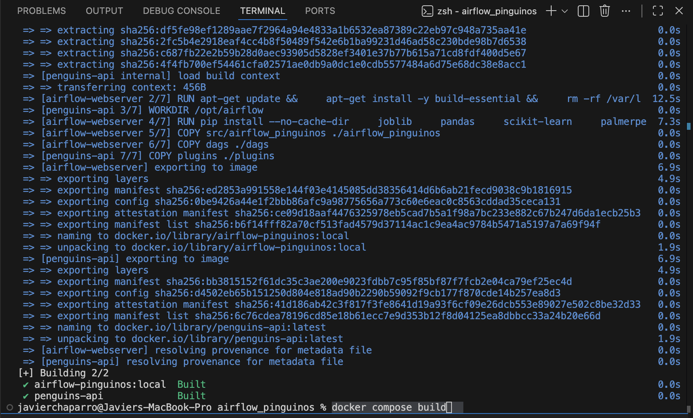
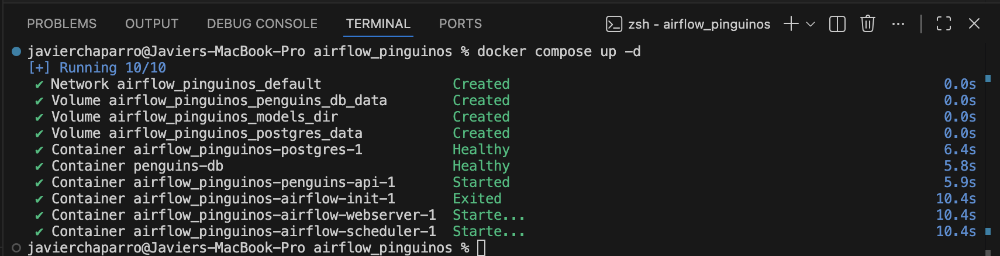
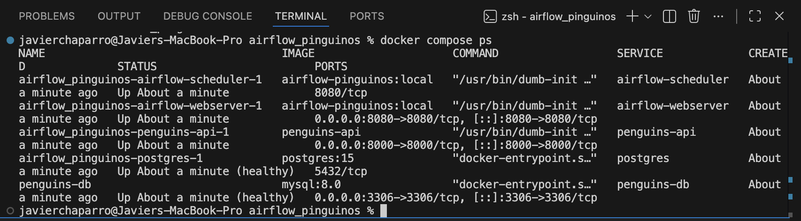
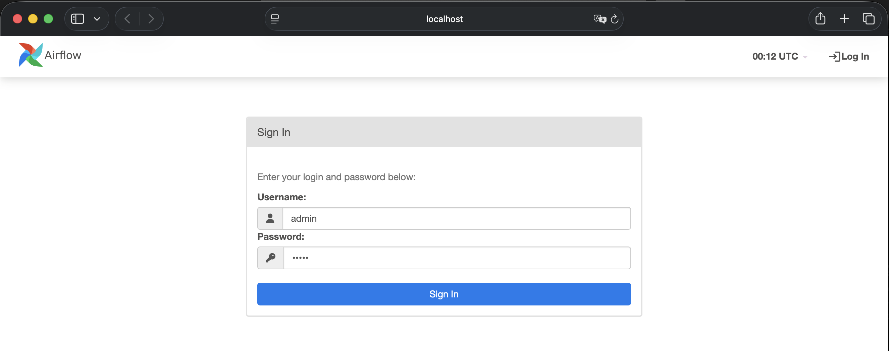
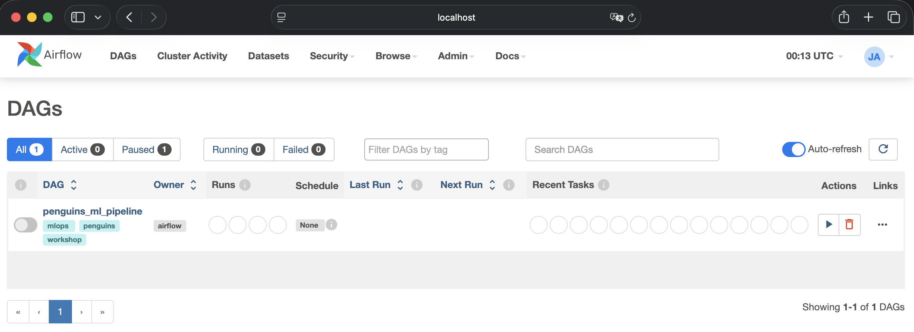
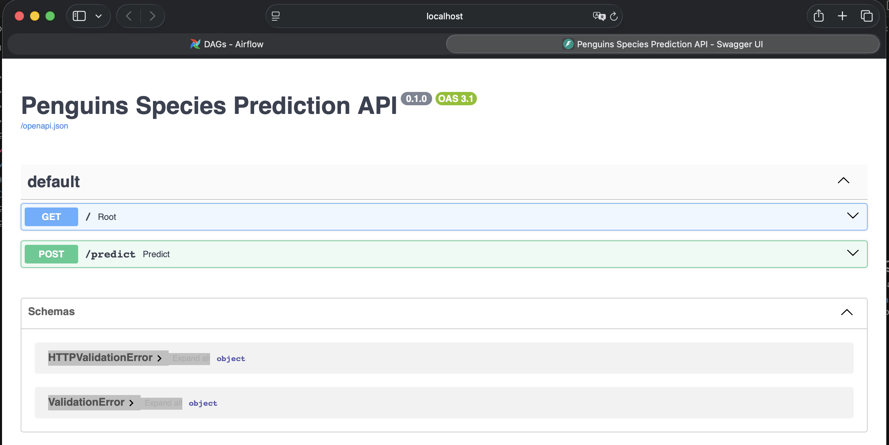
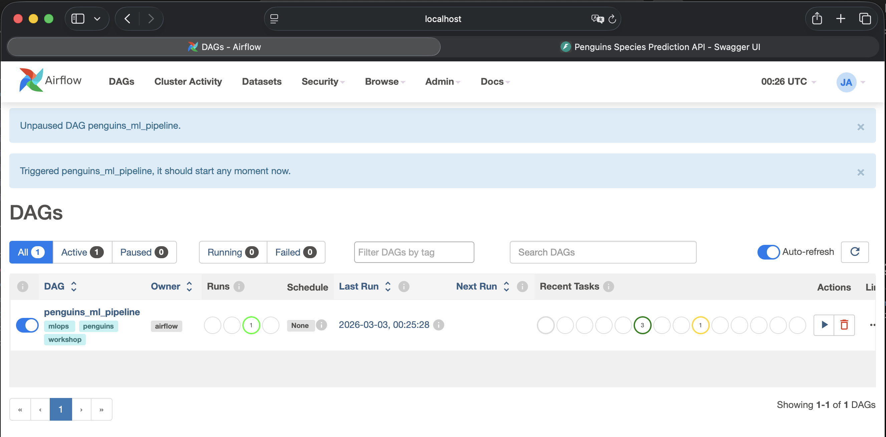
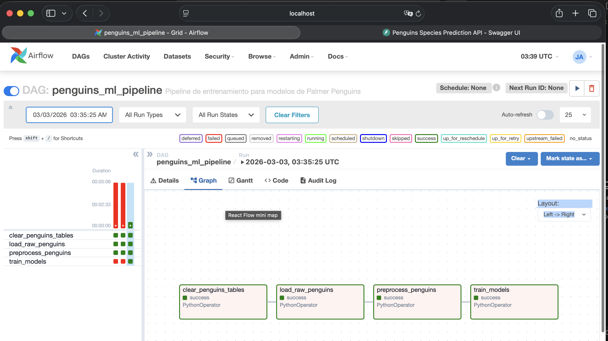
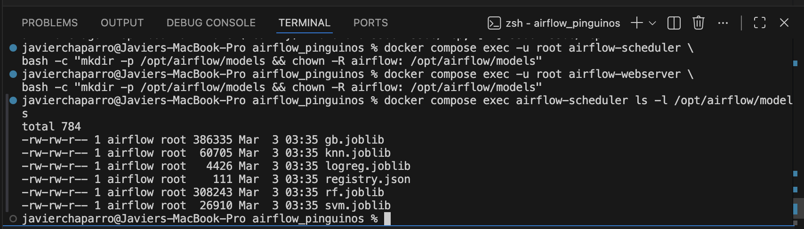

# MLOPS_Taller3 – Pipeline ML con Airflow + API + Docker Compose

## Descripción General

Este proyecto implementa un pipeline completo de Machine Learning usando:

- **Airflow** (scheduler + webserver)
- **Postgres** (base de datos de metadatos de Airflow)
- **MySQL** (base de datos exclusiva para datos de Penguins)
- **FastAPI** (servicio de inferencia desacoplado)
- **Docker Compose** (orquestación de todos los servicios)
- **Volumen compartido** para persistencia de modelos entrenados

El sistema entrena modelos de clasificación para predecir la especie de pingüinos (Palmer Penguins dataset) y expone un API para realizar inferencias.

---

# Arquitectura del Sistema

El sistema está compuesto por:

### 1. Airflow
- `airflow-webserver`
- `airflow-scheduler`
- Base de datos de metadatos: **Postgres**

### 2. Base de datos de datos
- **MySQL**
- Exclusiva para almacenar:
  - Datos crudos
  - Datos preprocesados

### 3. Servicio API
- **FastAPI**
- Carga modelos entrenados desde un volumen compartido
- Permite realizar inferencias vía HTTP

### 4. Volumen compartido
- `models_dir`
- Montado en `/opt/airflow/models`
- Permite que:
  - Airflow guarde modelos entrenados
  - API los cargue para inferencia

---

### 5. Estructura del Proyecto

airflow_pinguinos/
│
├── dags/
│   └── penguins_ml_dag.py
│
├── src/airflow_pinguinos/
│   ├── api.py
│   ├── config.py
│   ├── db.py
│   ├── etl.py
│   ├── train.py
│   └── init.py
│
├── docker-compose.yaml
├── Dockerfile
├── pyproject.toml
└── README.md

### 6. Levantar Todos Los Servicios 
```bash
docker compose build
```


```bash
docker compose up -d
```


```bash
docker compose ps
```


Debe aparecer:
	•	airflow-webserver
	•	airflow-scheduler
	•	penguins-db
	•	postgres
	•	penguins-api

### 7. Accesos
Airflow UI: 
```bash
http://localhost:8080
```
Usuario:
`admin`
Contraseña:
`admin`





API Swagger
```bash
http://localhost:8000/docs
```


### 8. Entrenamiento 
* Ir a Airflow UI
* Activar el DAG penguins_ml_pipeline
* Ejecutar el DAG

Cuando termine correctamente, los modelos deben existir en:
```bash
/opt/airflow/models
```




### 9. Probar Inferencia
* Ejemplo de entrada:

```bash
{
  "bill_length_mm": 39.1,
  "bill_depth_mm": 18.7,
  "flipper_length_mm": 181,
  "body_mass_g": 3750,
  "year": 2007,
  "island": "Torgersen",
  "sex": "male"
}
```
* Respuesta esperada

```bash
{
  "prediction": "Adelie"
}
```
### 10. Problema Común: Carpeta models Vacía o Permisos Incorrectos
En algunos sistemas, el volumen models_dir puede crearse con permisos incorrectos.

Si el DAG entrena pero no aparecen modelos o si la última actividad del pipeline llamada "train_models" falla, ejecutar:

```bash
docker compose exec -u root airflow-scheduler \
bash -c "mkdir -p /opt/airflow/models && chown -R airflow: /opt/airflow/models"

docker compose exec -u root airflow-webserver \
bash -c "mkdir -p /opt/airflow/models && chown -R airflow: /opt/airflow/models"
```
Luego volver a ejecutar el DAG y verificar:
```bash
docker compose exec airflow-scheduler ls -l /opt/airflow/models
```

Lista a visualizar:
* rf.joblib
* logreg.joblib
* svm.joblib
* gb.joblib
* knn.joblib
* registry.joblib



### 11. Servicios Incluidos en Docker Compose
Todos los servicios requeridos en el taller existen en un unico docker-compose.yaml
* Postgres
* MySQL
* Airflow
* API FastAPI
* Volumen compartido de modelos